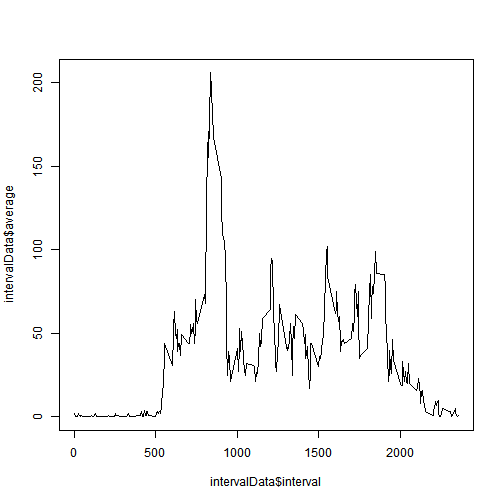
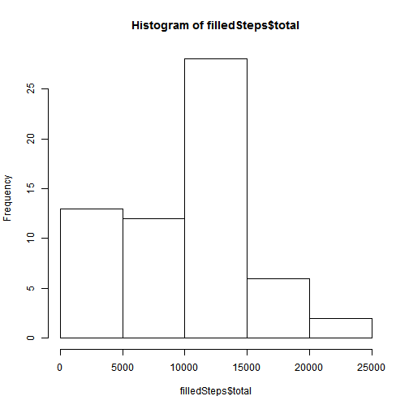
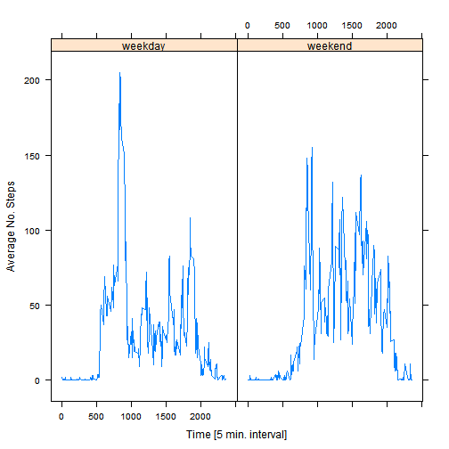

#Reproducible Research: Peer Assessment 1
##Author: Nick Grab

###Loading and Preprocessing the Data

Since this assingment has specific questions around missing data points, there was not much preprocessing required, beyond downloading the data.


```r
temp <- tempfile()
fileURL <- "http://d396qusza40orc.cloudfront.net/repdata%2Fdata%2Factivity.zip"
download.file(fileURL, temp)
activityData <- read.csv(unz(temp,"activity.csv"))
```
###What is mean total number of steps taken per day?

To answer this question I used the ddply function in the plyr package, summarizing total, average, and median steps by calendar date.  Missing values are ignored and values are reported to the nearest full step.

```r
library(plyr)
stepsData <- ddply(activityData, "date", summarize,
                   total = sum(steps, na.rm = TRUE),
                   average = round(mean(steps, na.rm = TRUE)),
                   median = round(median(steps, na.rm = TRUE)))
```
I then created a histrogram of total daily steps:

```r
hist(stepsData$total)  
```

 

**Summary table of average and median steps by calendar date.**  Rows with non-numeric values (i.e. NaN, NA) are dates where activity data are wholly missing; this issue addressed further in the *Inputting missing values* section below.

```r
stepsData[,c(1,3,4)]
```

```
##          date average median
## 1  2012-10-01     NaN     NA
## 2  2012-10-02       0      0
## 3  2012-10-03      39      0
## 4  2012-10-04      42      0
## 5  2012-10-05      46      0
## 6  2012-10-06      54      0
## 7  2012-10-07      38      0
## 8  2012-10-08     NaN     NA
## 9  2012-10-09      44      0
## 10 2012-10-10      34      0
## 11 2012-10-11      36      0
## 12 2012-10-12      60      0
## 13 2012-10-13      43      0
## 14 2012-10-14      52      0
## 15 2012-10-15      35      0
## 16 2012-10-16      52      0
## 17 2012-10-17      47      0
## 18 2012-10-18      35      0
## 19 2012-10-19      41      0
## 20 2012-10-20      36      0
## 21 2012-10-21      31      0
## 22 2012-10-22      47      0
## 23 2012-10-23      31      0
## 24 2012-10-24      29      0
## 25 2012-10-25       9      0
## 26 2012-10-26      24      0
## 27 2012-10-27      35      0
## 28 2012-10-28      40      0
## 29 2012-10-29      17      0
## 30 2012-10-30      34      0
## 31 2012-10-31      54      0
## 32 2012-11-01     NaN     NA
## 33 2012-11-02      37      0
## 34 2012-11-03      37      0
## 35 2012-11-04     NaN     NA
## 36 2012-11-05      36      0
## 37 2012-11-06      29      0
## 38 2012-11-07      45      0
## 39 2012-11-08      11      0
## 40 2012-11-09     NaN     NA
## 41 2012-11-10     NaN     NA
## 42 2012-11-11      44      0
## 43 2012-11-12      37      0
## 44 2012-11-13      25      0
## 45 2012-11-14     NaN     NA
## 46 2012-11-15       0      0
## 47 2012-11-16      19      0
## 48 2012-11-17      50      0
## 49 2012-11-18      52      0
## 50 2012-11-19      31      0
## 51 2012-11-20      16      0
## 52 2012-11-21      44      0
## 53 2012-11-22      71      0
## 54 2012-11-23      74      0
## 55 2012-11-24      50      0
## 56 2012-11-25      41      0
## 57 2012-11-26      39      0
## 58 2012-11-27      47      0
## 59 2012-11-28      35      0
## 60 2012-11-29      24      0
## 61 2012-11-30     NaN     NA
```
###What is the average daily activity pattern?

To answer this question I used the ddply function in the plyr package, summarizing average daily steps by interval.  Missing values are ignored and values are reported to the nearest full step.

```r
intervalData <- ddply(activityData, "interval", summarize,
                   average = round(mean(steps, na.rm = TRUE)),
                   median = round(median(steps, na.rm = TRUE)))
```
The data was then plotted as time series:

```r
plot(intervalData$interval,intervalData$average, type = "l")
```

 

**The maximum average number of steps taken was 206, and occurs in interval 835.**

###Inputing missing values
There are 2304 rows with missing data in this data set.  This number was found by counting the number of complete cases (i.e. records without NA).

```r
a <- count(complete.cases(activityData))
a$freq[1]
```

```
## [1] 2304
```
I decided to replace missing data with the median step of the corresponding interval.  The median value was chosen over the average to avoid skewing data by outliers.

```r
filledData <- activityData
for (i in 1:nrow(activityData)){
  if(is.na(activityData$steps[i])){
    filledData[i,1] <- intervalData[(intervalData$interval == activityData$interval[i]),3]
  } else{
    filledData[i,1] <- activityData$steps[i]
  }
}
```

Again using the ddply function found in the plyr package, I summarized total, average, and median steps by calendar date.  Values are reported to the nearest full step.

```r
filledSteps <- ddply(filledData, "date", summarize,
                   total = sum(steps, na.rm = TRUE),
                   average = round(mean(steps, na.rm = TRUE)),
                   median = round(median(steps, na.rm = TRUE)))
```
I then created a histrogram of total daily steps:

```r
hist(filledSteps$total)
```

 

**Summary table of average and median steps by calendar date.**  Beside the fact that the table no longer contains non-numeric entries, by replacing the missing data with the median we've changed the sample size and therefore changed the averages.

```r
filledSteps[,c(1,3,4)]
```

```
##          date average median
## 1  2012-10-01       4      0
## 2  2012-10-02       0      0
## 3  2012-10-03      39      0
## 4  2012-10-04      42      0
## 5  2012-10-05      46      0
## 6  2012-10-06      54      0
## 7  2012-10-07      38      0
## 8  2012-10-08       4      0
## 9  2012-10-09      44      0
## 10 2012-10-10      34      0
## 11 2012-10-11      36      0
## 12 2012-10-12      60      0
## 13 2012-10-13      43      0
## 14 2012-10-14      52      0
## 15 2012-10-15      35      0
## 16 2012-10-16      52      0
## 17 2012-10-17      47      0
## 18 2012-10-18      35      0
## 19 2012-10-19      41      0
## 20 2012-10-20      36      0
## 21 2012-10-21      31      0
## 22 2012-10-22      47      0
## 23 2012-10-23      31      0
## 24 2012-10-24      29      0
## 25 2012-10-25       9      0
## 26 2012-10-26      24      0
## 27 2012-10-27      35      0
## 28 2012-10-28      40      0
## 29 2012-10-29      17      0
## 30 2012-10-30      34      0
## 31 2012-10-31      54      0
## 32 2012-11-01       4      0
## 33 2012-11-02      37      0
## 34 2012-11-03      37      0
## 35 2012-11-04       4      0
## 36 2012-11-05      36      0
## 37 2012-11-06      29      0
## 38 2012-11-07      45      0
## 39 2012-11-08      11      0
## 40 2012-11-09       4      0
## 41 2012-11-10       4      0
## 42 2012-11-11      44      0
## 43 2012-11-12      37      0
## 44 2012-11-13      25      0
## 45 2012-11-14       4      0
## 46 2012-11-15       0      0
## 47 2012-11-16      19      0
## 48 2012-11-17      50      0
## 49 2012-11-18      52      0
## 50 2012-11-19      31      0
## 51 2012-11-20      16      0
## 52 2012-11-21      44      0
## 53 2012-11-22      71      0
## 54 2012-11-23      74      0
## 55 2012-11-24      50      0
## 56 2012-11-25      41      0
## 57 2012-11-26      39      0
## 58 2012-11-27      47      0
## 59 2012-11-28      35      0
## 60 2012-11-29      24      0
## 61 2012-11-30       4      0
```

###Are there differences in activity patterns between weekdays and weekends?

Using the weekdays function, I first identified each rows weekday name.  I then loopd through the dataframe another time and tagged all rows with "Saturday" or "Sunday" weekday names as "weekend"; all others were tagged as "weekday"

```r
filledData$day <- weekdays(as.Date(filledData$date,'%Y-%m-%d'))
for (i in 1:nrow(filledData)){
  if (filledData$day[i] == "Saturday" | filledData$day[i] == "Sunday"){
    filledData$weekPart[i] <- "weekend"
  } else {
    filledData$weekPart[i] <- "weekday"
  }
}
```
Again using the ddply function found in the plyr package, I summarized average steps by week part (i.e. weekend or weekday) and interval.  Values are reported to the nearest full step.

```r
intervalWeek <- ddply(filledData, c("weekPart","interval"), summarize,
                   average = round(mean(steps, na.rm = TRUE)))
```

Data was then plotted as time series in a panel plot:

```r
library(lattice)
xyplot(intervalWeek$average ~ intervalWeek$interval | intervalWeek$weekPart, 
       ylab = "Average No. Steps", 
       xlab = "Time [5 min. interval]",
       type = "l")
```

 
